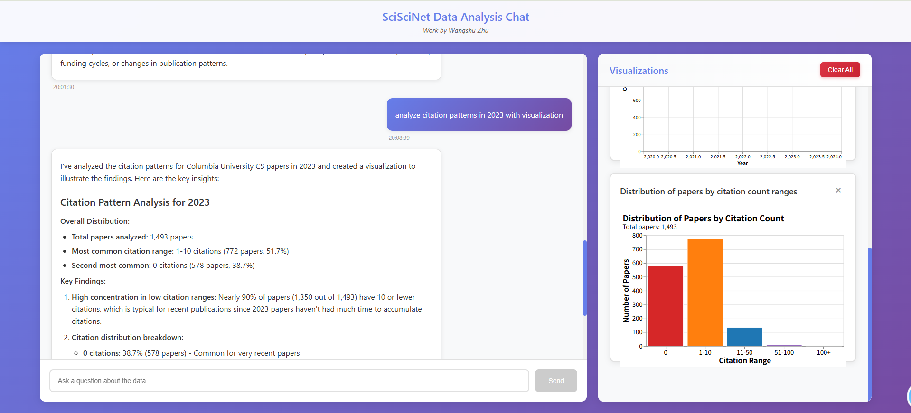

# LLM-Powered Data Analysis System

A multi-agent LLM framework for automated data analysis, filtering, and visualization of scientific paper data from SciSciNet. This system uses LangChain to coordinate specialized agents that understand natural language queries, query databases, perform statistical analysis, and generate interactive Vega-Lite visualizations.

[Demo video here](https://drive.google.com/file/d/1kbB5_BI-j1WKyL4q8_LRmz67eDCRk3GH/view?usp=drive_link)

## Project Overview

This project implements a web-based chatbot interface that allows users to interact with a scientific paper database using natural language. The system automatically:

1. **Understands user queries** - Parses natural language questions about paper data
2. **Queries the database** - Executes appropriate SQL queries using DuckDB
3. **Analyzes results** - Performs statistical analysis and data aggregation
4. **Generates visualizations** - Creates interactive Vega-Lite charts with filtering and hovering interactions

[]
## Tech Stack

### Backend
- **Python 3.10+**
- **Flask** - Web framework
- **LangChain** - LLM framework for multi-agent orchestration
- **AWS Bedrock** - LLM service (Claude Sonnet 4)
- **DuckDB** - In-memory SQL database for efficient Parquet queries
- **Pandas** - Data manipulation
- **Vega-Lite** - Chart specification generation

### Frontend
- **React 18 + TypeScript** - UI framework
- **Vega-Lite** - Interactive visualization library
- **Axios** - HTTP client
- **ReactMarkdown** - Markdown rendering


## Quick Start

### Prerequisites

- Python 3.10+
- Node.js 16+
- AWS credentials configured (`aws configure`)
- Access to AWS Bedrock in `us-east-2` region

### 1. Data Setup

Download data from SciSciNet by GCS:

```bash
cd Project1
mkdir -p data
gsutil -m cp gs://sciscinet-neo/v2/sciscinet_papers.parquet ./data/
gsutil -m cp gs://sciscinet-neo/v2/sciscinet_paperrefs.parquet ./data/
gsutil -m cp gs://sciscinet-neo/v2/sciscinet_paper_author_affiliation.parquet ./data/
gsutil -m cp gs://sciscinet-neo/v2/sciscinet_link_patents.parquet ./data/
gsutil -m cp gs://sciscinet-neo/v2/sciscinet_fields.parquet ./data/
gsutil -m cp gs://sciscinet-neo/v2/sciscinet_paperfields.parquet ./data/
```

Then create sample data by running following files, then it should be in `backend/data/` directory.

```bash
cd backend
python processors/sample_creator.py
```

This will create filtered sample parquet files from the full SciSciNet dataset.

### 2. Environment Configuration

**AWS Credentials:**
AWS Bedrock uses AWS IAM credentials (not API keys). Configure them using:

```bash
aws configure
```

This will prompt for:
- AWS Access Key ID
- AWS Secret Access Key
- Default region (use `us-east-2`)
- Default output format (use `json`)

The credentials are stored in `~/.aws/credentials` and are automatically used by boto3.


### 3. Backend Setup

```bash
cd backend
pip install -r requirements.txt
python app.py
```

Backend runs on `http://localhost:5000`

### 4. Frontend Setup

```bash
cd frontend
npm install
npm start
```

Frontend runs on `http://localhost:3000`


## Architecture

### Multi-Agent System

The system uses a hierarchical multi-agent architecture where specialized agents are exposed as tools to a central orchestrator, enabling flexible workflow composition.

#### 1. Orchestrator Agent (Main Coordinator)

The orchestrator is a ReAct-based agent that coordinates the entire workflow:

**Architecture Pattern:**
- Uses LangChain's `create_react_agent` with `AgentExecutor`
- Maintains conversation memory via `ConversationBufferWindowMemory` (300 message window)
- Exposes specialized agents as tools, allowing dynamic workflow composition
- Implements visualization tracking to maintain context across conversations

**Workflow Coordination:**
1. **Query Understanding**: Parses natural language to determine intent (data query, visualization request, conversational question)
2. **Agent Selection**: Dynamically selects appropriate specialized agent or tool based on query type
3. **Tool Invocation**: Calls specialized agents (DataAnalysisAgent, VisualizationAgent) as tools
4. **Result Aggregation**: Combines results from multiple agents when needed
5. **Context Management**: Tracks visualization specs for improvement requests (e.g., "make this chart more beautiful")

**Key Design Decision**: Instead of a fixed pipeline, the orchestrator treats specialized agents as tools, enabling:
- Flexible workflow composition (not every query needs all agents)
- Dynamic agent selection based on query complexity
- Multi-step workflows (e.g., query data → analyze → visualize)
- Conversational capabilities (answering "why" questions using data insights)

#### 2. Data Analysis Agent (Specialized Agent)

A ReAct agent specialized for database queries and statistical analysis:

**ReAct Workflow:**
The agent follows the ReAct (Reasoning + Acting) pattern:

```
Thought: I need to understand what the user is asking for
Action: query_papers_by_field
Action Input: {"limit": 5, "field_name": "machine learning"}
Observation: {"success": true, "data": [...], "stats": {...}, "chart_type": "bar"}
Thought: I have the data, now I should format it as JSON
Final Answer: {"success": true, "data": [...], "stats": {...}, "chart_type": "bar"}
```

**Tool Arsenal:**
The agent has access to 12 specialized tools organized into four categories:

**1. Basic Query Tools (5 tools):**
- `query_papers_by_field`: Groups papers by research field with optional filtering
  - Parameters: `limit`, `field_name` (for filtering specific fields)
  - Returns: Field names, paper counts, statistics (total_fields, total_papers, top_field)
  - Use case: "Show me top 5 fields" or "papers in machine learning"
  
- `query_papers_by_year`: Temporal analysis with flexible year range support
  - Parameters: `year` (single), `start_year`/`end_year` (range), `years` (number of years back)
  - Returns: Year, paper count, statistics (total_years, total_papers, avg_per_year, max_year)
  - Use case: "Papers by year" or "trends from 2020 to 2024"
  
- `query_papers_by_citations`: Filters papers by citation count ranges
  - Parameters: `min_citations`, `max_citations`, `year`, `field`
  - Returns: Paper metadata with citation counts
  - Use case: "Highly cited papers in 2023" or "papers with 10-50 citations"
  
- `query_papers_by_patents`: Filters papers by patent count
  - Parameters: `min_patents`, `has_patents` (boolean), `year`
  - Returns: Papers with patent information
  - Use case: "Papers with patents" or "patent-rich papers in 2022"
  
- `query_papers_advanced`: Multi-criteria filtering combining all above filters
  - Parameters: `year`, `field`, `min_citations`, `min_patents`, `limit`
  - Returns: Filtered paper list with all metadata
  - Use case: Complex queries requiring multiple filters

**2. Exploration Tools (3 tools):**
- `explore_available_fields`: Lists all research fields with paper counts
  - No parameters required
  - Returns: Complete field list with statistics
  - Use case: "What fields are available?" or data discovery
  
- `explore_available_years`: Lists all available years with paper counts
  - No parameters required
  - Returns: Year list with statistics
  - Use case: "What years have data?" or temporal data discovery
  
- `explore_top_authors`: Finds top authors by paper count with optional filtering
  - Parameters: `limit`, `min_papers`, `field_filter`
  - Returns: Author IDs, paper counts, statistics
  - Use case: "Top 10 authors" or "most productive authors in ML"

**3. Analysis Tools (3 tools):**
- `analyze_field_trends`: Analyzes field growth/decline over time periods
  - Parameters: `field`, `start_year`, `end_year`, `metric` (count/citations/patents)
  - Returns: Time series data with trend statistics
  - Use case: "How has machine learning grown?" or "field trends 2020-2024"
  
- `analyze_citation_patterns`: Statistical analysis of citation distributions
  - Parameters: `year`, `field`, `min_citations`
  - Returns: Citation distribution with mean, median, percentiles
  - Use case: "Citation patterns in 2023" or "citation distribution for ML papers"
  
- `analyze_patent_distribution`: Patent citation frequency analysis
  - Parameters: `year`, `field`
  - Returns: Patent count distribution (0, 1, 2, ... patents per paper)
  - Use case: "Patent distribution" or "how many papers have patents?"

**4. Communication Tools (1 tool):**
- `ask_clarification_question`: Asks users for missing information
  - Parameters: `question` (the clarification question to ask)
  - Returns: User-facing question string
  - Use case: When agent needs more information to complete query

**Tool Input Format:**
All tools accept JSON strings as input (e.g., `'{"limit": 5, "field_name": "ML"}'`). The agent automatically formats tool inputs, and tools parse JSON internally to extract parameters.

**Execution Flow:**
1. Agent receives natural language query
2. ReAct loop: Thought → Action → Observation (repeats until solution found)
3. Tool execution: Calls DuckDB via `QueryExecutor` to query Parquet files
4. Result formatting: Returns structured JSON with `success`, `data`, `stats`, `chart_type`

#### 3. Visualization Agent (Specialized Agent)

Generates Vega-Lite specifications using three different strategies:

**Strategy 1: Template-Based Generation (Primary)**
- Uses predefined functions (`create_bar_chart`, `create_line_chart`, `create_histogram`)
- Automatically detects data structure and selects appropriate template
- Generates interactive features: tooltips, brush selection, click selection
- Ensures unique selection names (UUID-based) to prevent conflicts when multiple charts are rendered

**Strategy 2: LLM-Based Generation (Fallback)**
- When templates don't match data structure, uses LLM to generate Vega-Lite spec
- Provides analysis results and chart type to LLM
- LLM generates complete Vega-Lite JSON specification
- Used for complex or custom chart types

**Strategy 3: Code Execution (Advanced)**
- Executes custom Python code for highly customized visualizations
- Provides safe execution environment with controlled namespace
- Supports common libraries (pandas, matplotlib, numpy) if available
- Code must create `vega_spec` variable with Vega-Lite specification
- Used for "make chart more beautiful" type requests where styling needs enhancement

**Visualization Features:**
All generated charts include:
- **Tooltips**: Hover to see detailed data points
- **Brush Selection**: Drag on axes to filter data ranges
- **Click Selection**: Click points/bars to highlight
- **Responsive Sizing**: Charts adapt to container dimensions using ResizeObserver
- **Unique Identifiers**: Each chart gets UUID-based selection names to prevent conflicts

#### Multi-Agent Workflow Example

**User Query**: "Show me the top 5 research fields and visualize them"

**Step-by-Step Execution:**

1. **Orchestrator receives query**
   - Parses intent: data query + visualization request
   - Determines this requires both DataAnalysisAgent and VisualizationAgent
   - Enters ReAct loop: Thought → Action → Observation

2. **Orchestrator's ReAct Loop - First Iteration:**
   ```
   Thought: User wants top 5 fields and visualization. I need to query data first.
   Action: query_paper_data
   Action Input: "top 5 research fields"
   Observation: [Calls DataAnalysisAgent internally]
   ```

3. **DataAnalysisAgent Execution (as tool):**
   - DataAnalysisAgent receives query: "top 5 research fields"
   - Enters its own ReAct loop:
     ```
     Thought: User wants top 5 fields. I should use query_papers_by_field tool.
     Action: query_papers_by_field
     Action Input: '{"limit": 5}'
     Observation: {"success": true, "data": [...], "stats": {...}, "chart_type": "bar"}
     Thought: I have the data. I should return it as JSON.
     Final Answer: {"success": true, "data": [...], "stats": {...}, "chart_type": "bar"}
     ```
   - Tool execution flow:
     - Tool parses JSON: `{"limit": 5}`
     - Calls `executor.get_papers_by_field(limit=5)`
     - DuckDB executes SQL: `SELECT field, COUNT(*) FROM papers GROUP BY field ORDER BY COUNT(*) DESC LIMIT 5`
     - Returns DataFrame, converted to JSON records
     - Calculates statistics (total_fields, total_papers, top_field)

4. **Orchestrator receives analysis result**
   - Observation from DataAnalysisAgent: Structured JSON with data and stats
   - Thought: "I have the data. Now I need to generate visualization."
   - Continues ReAct loop

5. **Orchestrator's ReAct Loop - Second Iteration:**
   ```
   Thought: I have the data. Now I need to visualize it.
   Action: generate_visualization
   Action Input: '{"success": true, "data": [...], "stats": {...}, "chart_type": "bar"}'
   Observation: [Calls VisualizationAgent internally]
   ```

6. **VisualizationAgent Execution (as tool):**
   - Receives analysis result JSON
   - Detects `chart_type: "bar"` and data structure matches template
   - Uses Strategy 1 (Template-based generation):
     - Calls `create_bar_chart(data, "display_name", "paper_count", "Top 5 Research Fields")`
     - Function generates Vega-Lite spec with:
       - Unique selection names (UUID-based: `brush_abc123`, `click_abc123`)
       - Tooltip encoding for hover interactions
       - Brush selection for filtering
       - Click selection for highlighting
       - Conditional color encoding based on selections
   - Returns: `{"success": true, "spec": {...}, "stats": {...}}`

7. **Orchestrator tracks visualization**
   - Tracking tool wrapper captures spec from VisualizationAgent output
   - Stores in `last_viz_spec` attribute
   - Thought: "I have both data analysis and visualization. I can provide final answer."
   - Final Answer: Combines analysis message and chart spec
   - Returns to frontend

**Memory and Context:**
- Conversation history maintained in `ConversationBufferWindowMemory` (300 messages)
- When user says "make this chart more beautiful", orchestrator:
  1. Detects improvement keywords ("beautiful", "pretty", "better", etc.)
  2. Checks `last_viz_spec` attribute (not just memory - direct reference)
  3. Enhances query: Adds context about previous visualization type
  4. Calls VisualizationAgent with Strategy 3 (Code execution)
  5. Agent generates Python code that:
     - Takes previous chart's data
     - Creates enhanced Vega-Lite spec with better colors, styling, formatting
     - Executes code in safe environment
     - Returns improved specification
  6. Updates `last_viz_spec` with new improved version

### Data Processing

- **Sample Data**: 5-year dataset (2020-2024) of Columbia University Computer Science papers
- **Data Source**: SciSciNet parquet files filtered for:
  - Institution: Columbia University
  - Field: Computer Science
  - Document type: Articles only
  - Retraction status: Not retracted
  - Author position: First author
- **Query Execution**: DuckDB for efficient SQL queries on Parquet files

## Features

### Natural Language Query Interface

Users can ask questions in natural language, such as:
- "Show me the number of papers by field"
- "Show me the number of papers by year"
- "What are the top 5 research fields?"
- "Show citation patterns in 2023"

### Interactive Visualizations

All charts support:
- **Hovering**: Tooltips show detailed information
- **Click Selection**: Point selection for highlighting
- **Filer Selection**: Filter X-asis for choosing and highlighting 
- **Responsive Sizing**: Charts adapt to container size

### Chart Types

- **Bar Charts**: For categorical data (e.g., papers by field)
- **Line Charts**: For temporal data (e.g., papers by year)
- **Histograms**: For distribution data (e.g., citation patterns)

### Conversational Memory

The system maintains conversation context:
- Remembers previous queries and visualizations
- Understands references to "this chart" or "the figure"
- Can improve visualizations based on previous context
- Supports multi-turn conversations

## Project Structure

```
Project2/
├── backend/
│   ├── agents/              # LLM agents
│   │   ├── orchestrator.py # Main coordinator
│   │   ├── data_agent.py   # Data analysis agent
│   │   ├── viz_agent.py    # Visualization agent
│   │   └── tools.py        # Database query tools
│   ├── api/
│   │   └── chat.py         # Chat API endpoint
│   ├── processors/
│   │   ├── query_executor.py    # DuckDB query execution
│   │   └── sample_creator.py   # Sample data generation
│   ├── utils/
│   │   ├── llm_client.py        # LLM client setup
│   │   └── vega_spec_generator.py # Vega-Lite spec generation
│   ├── data/               # Sample parquet files
│   ├── app.py             # Flask application
│   └── requirements.txt
├── frontend/
│   ├── src/
│   │   ├── components/
│   │   │   ├── ChatInterface/    # Chat UI
│   │   │   └── Dashboard/      # Visualization dashboard
│   │   └── api/
│   │       └── client.ts       # API client
│   └── package.json
└── README.md
```


### System Workflow Summary
**Query Execution Flow:**
```
User Query (Natural Language)
    ↓
Orchestrator Agent (ReAct Loop)
    ↓
[If data needed] → DataAnalysisAgent (ReAct Loop)
    ↓
Tool Selection (e.g., query_papers_by_field)
    ↓
JSON Input Parsing: '{"limit": 5}' → {"limit": 5}
    ↓
QueryExecutor.get_papers_by_field(limit=5)
    ↓
DuckDB SQL Query: SELECT field, COUNT(*) FROM papers GROUP BY field LIMIT 5
    ↓
Parquet File Scan (Columnar Processing)
    ↓
Pandas DataFrame Result
    ↓
JSON Serialization: {"success": true, "data": [...], "stats": {...}}
    ↓
Agent Observation
    ↓
[If visualization needed] → VisualizationAgent
    ↓
Template/LLM/Code Execution → Vega-Lite Spec
    ↓
Frontend Rendering
```
**Complete Request Flow:**

1. **User Input** → Frontend sends natural language query to `/api/chat/message`

2. **Orchestrator Processing**:
   - Receives query, checks memory for context
   - Enters ReAct loop to determine required agents/tools
   - May call DataAnalysisAgent (if data needed) or VisualizationAgent (if only visualization needed)
   - Coordinates multi-step workflows when needed

3. **Data Analysis** (if needed):
   - DataAnalysisAgent selects appropriate tool from 12 available tools
   - Tool executes DuckDB query on Parquet files
   - Returns structured JSON with data, stats, and suggested chart_type

4. **Visualization** (if needed):
   - VisualizationAgent receives analysis results
   - Selects generation strategy (template/LLM/code)
   - Generates Vega-Lite specification with interactive features
   - Returns spec to orchestrator

5. **Response Assembly**:
   - Orchestrator combines analysis message, chart spec, and statistics
   - Tracks visualization spec for future reference
   - Returns complete response to frontend

6. **Frontend Rendering**:
   - React component receives chart spec
   - Vega-Embed renders interactive chart
   - ResizeObserver ensures responsive sizing
   - User can interact (hover, filter, select)
